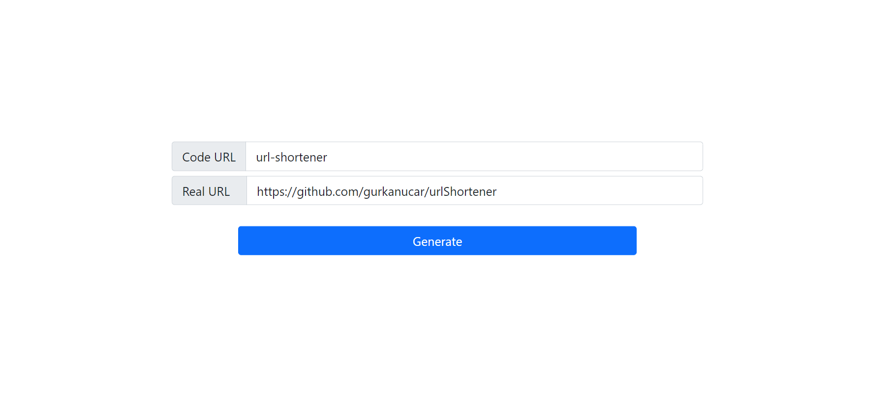

# Spring Boot URL Shortener

## Setup:

**! INFO**: if you want to make a quick test, clone the **memory-db** branch.

- Clone the project
- Create database in MYSQL ( db name is "urlshortener", you can configure from application.yaml)
- Run project

## Routes:

Base URL:

[http://localhost:8080](http://localhost:8080)

GET      /{code}          → It redirects to the real url

GET     /show/{code} → It displays info about the url by shorted code

GET     /fast/{realUrl} → This is the fastest way of creating shortener url with random generated code

POST   /                     → You can create shortener url by using your custom code with post method

ShortUrl Dto :

```json
{
    "code":"short-project",
    "realValue":"https://github.com/gurkanucar/urlShortener"
}
```

## Simple Home Page -> [http://localhost:8080](http://localhost:8080)



